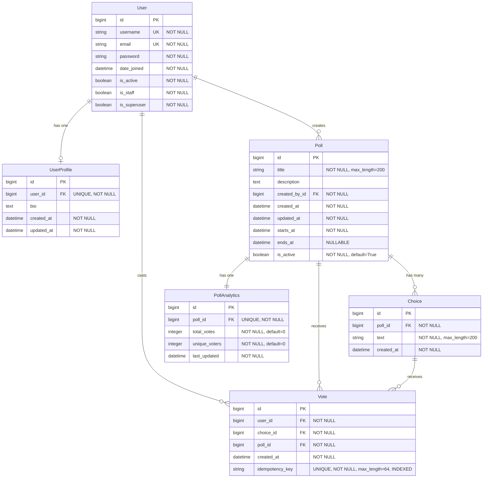

# Database ERD Design

## Overview

This document describes the Entity-Relationship Diagram (ERD) for the Provote voting platform database. The design focuses on data integrity, performance, and scalability for a voting system with idempotent operations.

## Entity-Relationship Diagram

### Visual ERD (Mermaid)



## Database Tables

### 1. User (Django Built-in)

**Table Name:** `auth_user`

**Description:** Django's built-in user authentication model. Stores user account information.

| Column Name | Data Type | Constraints | Description |
|------------|-----------|-------------|-------------|
| `id` | BIGINT | PRIMARY KEY, AUTO_INCREMENT | Unique identifier |
| `username` | VARCHAR(150) | UNIQUE, NOT NULL | Username for login |
| `email` | VARCHAR(254) | UNIQUE, NOT NULL | User email address |
| `password` | VARCHAR(128) | NOT NULL | Hashed password |
| `first_name` | VARCHAR(150) | NULLABLE | User's first name |
| `last_name` | VARCHAR(150) | NULLABLE | User's last name |
| `is_active` | BOOLEAN | NOT NULL, DEFAULT=True | Account active status |
| `is_staff` | BOOLEAN | NOT NULL, DEFAULT=False | Staff access |
| `is_superuser` | BOOLEAN | NOT NULL, DEFAULT=False | Admin access |
| `date_joined` | TIMESTAMP | NOT NULL | Account creation date |
| `last_login` | TIMESTAMP | NULLABLE | Last login timestamp |

**Indexes:**
- Primary Key: `id`
- Unique Index: `username`
- Unique Index: `email`

**Design Decisions:**
- Uses Django's built-in User model for authentication
- Leverages existing security features and password hashing
- Standard Django fields provide flexibility for future extensions

---

### 2. UserProfile

**Table Name:** `users_userprofile`

**Description:** Extended user profile information. One-to-one relationship with User.

| Column Name | Data Type | Constraints | Description |
|------------|-----------|-------------|-------------|
| `id` | BIGINT | PRIMARY KEY, AUTO_INCREMENT | Unique identifier |
| `user_id` | BIGINT | FOREIGN KEY, UNIQUE, NOT NULL | Reference to `auth_user.id` |
| `bio` | TEXT | NULLABLE | User biography |
| `created_at` | TIMESTAMP | NOT NULL, AUTO_UPDATE | Profile creation timestamp |
| `updated_at` | TIMESTAMP | NOT NULL, AUTO_UPDATE | Last update timestamp |

**Relationships:**
- **One-to-One** with `User` via `user_id`
  - `ON DELETE CASCADE`: If user is deleted, profile is deleted

**Indexes:**
- Primary Key: `id`
- Unique Index: `user_id` (enforces one-to-one relationship)

**Design Decisions:**
- Separate table for profile data keeps User model clean
- One-to-one relationship ensures one profile per user
- CASCADE delete maintains referential integrity
- Timestamps track profile lifecycle

---

### 3. Poll

**Table Name:** `polls_poll`

**Description:** Represents a voting poll with title, description, and scheduling information.

| Column Name | Data Type | Constraints | Description |
|------------|-----------|-------------|-------------|
| `id` | BIGINT | PRIMARY KEY, AUTO_INCREMENT | Unique identifier |
| `title` | VARCHAR(200) | NOT NULL | Poll title |
| `description` | TEXT | NULLABLE | Poll description |
| `created_by_id` | BIGINT | FOREIGN KEY, NOT NULL | Reference to `auth_user.id` |
| `created_at` | TIMESTAMP | NOT NULL, AUTO_UPDATE | Creation timestamp |
| `updated_at` | TIMESTAMP | NOT NULL, AUTO_UPDATE | Last update timestamp |
| `starts_at` | TIMESTAMP | NOT NULL | Poll start date/time |
| `ends_at` | TIMESTAMP | NULLABLE | Poll end date/time (null = no end) |
| `is_active` | BOOLEAN | NOT NULL, DEFAULT=True | Active status flag |

**Relationships:**
- **Many-to-One** with `User` via `created_by_id`
  - `ON DELETE CASCADE`: If creator is deleted, poll is deleted
- **One-to-Many** with `Choice` (poll has many choices)
- **One-to-Many** with `Vote` (poll receives many votes)
- **One-to-One** with `PollAnalytics` (poll has one analytics record)

**Indexes:**
- Primary Key: `id`
- Index: `created_at` (for ordering: `-created_at`)
- Foreign Key Index: `created_by_id`

**Design Decisions:**
- `starts_at` and `ends_at` allow scheduled polls
- `ends_at` is nullable to support open-ended polls
- `is_active` flag allows soft-deletion without data loss
- CASCADE delete ensures data consistency when creator is removed
- Default ordering by `-created_at` for newest-first display

---

### 4. Choice

**Table Name:** `polls_choice`

**Description:** Represents a voting option/choice within a poll.

| Column Name | Data Type | Constraints | Description |
|------------|-----------|-------------|-------------|
| `id` | BIGINT | PRIMARY KEY, AUTO_INCREMENT | Unique identifier |
| `poll_id` | BIGINT | FOREIGN KEY, NOT NULL | Reference to `polls_poll.id` |
| `text` | VARCHAR(200) | NOT NULL | Choice text/option |
| `created_at` | TIMESTAMP | NOT NULL, AUTO_UPDATE | Creation timestamp |

**Relationships:**
- **Many-to-One** with `Poll` via `poll_id`
  - `ON DELETE CASCADE`: If poll is deleted, all choices are deleted
- **One-to-Many** with `Vote` (choice receives many votes)

**Indexes:**
- Primary Key: `id`
- Foreign Key Index: `poll_id`
- Index: `id` (for ordering: `id`)

**Design Decisions:**
- Simple text field for choice options (flexible for various poll types)
- CASCADE delete ensures choices are removed with poll
- Ordered by `id` to maintain creation order
- No unique constraint on text - allows duplicate options if needed

---

### 5. Vote

**Table Name:** `votes_vote`

**Description:** Represents a user's vote on a poll choice. Includes idempotency for duplicate prevention.

| Column Name | Data Type | Constraints | Description |
|------------|-----------|-------------|-------------|
| `id` | BIGINT | PRIMARY KEY, AUTO_INCREMENT | Unique identifier |
| `user_id` | BIGINT | FOREIGN KEY, NOT NULL | Reference to `auth_user.id` |
| `choice_id` | BIGINT | FOREIGN KEY, NOT NULL | Reference to `polls_choice.id` |
| `poll_id` | BIGINT | FOREIGN KEY, NOT NULL | Reference to `polls_poll.id` |
| `created_at` | TIMESTAMP | NOT NULL, AUTO_UPDATE | Vote timestamp |
| `idempotency_key` | VARCHAR(64) | UNIQUE, NOT NULL, INDEXED | Idempotency key for duplicate prevention |

**Relationships:**
- **Many-to-One** with `User` via `user_id`
  - `ON DELETE CASCADE`: If user is deleted, votes are deleted
- **Many-to-One** with `Choice` via `choice_id`
  - `ON DELETE CASCADE`: If choice is deleted, votes are deleted
- **Many-to-One** with `Poll` via `poll_id`
  - `ON DELETE CASCADE`: If poll is deleted, votes are deleted

**Constraints:**
- **UNIQUE TOGETHER:** `(user_id, poll_id)` - Ensures one vote per user per poll
- **UNIQUE:** `idempotency_key` - Prevents duplicate votes from retries

**Indexes:**
- Primary Key: `id`
- Unique Index: `idempotency_key` (for fast idempotency checks)
- Composite Index: `(user_id, poll_id)` (for unique constraint and fast lookups)
- Composite Index: `(poll_id, created_at)` (for poll vote history queries)
- Foreign Key Indexes: `user_id`, `choice_id`, `poll_id`

**Design Decisions:**
- **Idempotency Key:** Prevents duplicate votes from network retries or client errors
- **Unique Constraint (user, poll):** Enforces business rule: one vote per user per poll
- **Redundant poll_id:** Stored for performance (avoids JOIN to get poll from choice)
- **Composite Index (poll_id, created_at):** Optimizes queries for vote history and analytics
- **Composite Index (user_id, poll_id):** Optimizes unique constraint checks
- All foreign keys use CASCADE delete for data consistency

---

### 6. PollAnalytics

**Table Name:** `analytics_pollanalytics`

**Description:** Pre-computed analytics data for polls. Denormalized for performance.

| Column Name | Data Type | Constraints | Description |
|------------|-----------|-------------|-------------|
| `id` | BIGINT | PRIMARY KEY, AUTO_INCREMENT | Unique identifier |
| `poll_id` | BIGINT | FOREIGN KEY, UNIQUE, NOT NULL | Reference to `polls_poll.id` |
| `total_votes` | INTEGER | NOT NULL, DEFAULT=0 | Total vote count |
| `unique_voters` | INTEGER | NOT NULL, DEFAULT=0 | Number of unique voters |
| `last_updated` | TIMESTAMP | NOT NULL, AUTO_UPDATE | Last update timestamp |

**Relationships:**
- **One-to-One** with `Poll` via `poll_id`
  - `ON DELETE CASCADE`: If poll is deleted, analytics are deleted

**Indexes:**
- Primary Key: `id`
- Unique Index: `poll_id` (enforces one-to-one relationship)

**Design Decisions:**
- **Denormalized Design:** Stores pre-computed values for fast reads
- **One-to-One Relationship:** Each poll has exactly one analytics record
- **Default Values:** Initialize with 0 to avoid NULL issues
- **Auto-update Timestamp:** Tracks when analytics were last recalculated
- **Performance:** Avoids expensive COUNT queries on Vote table

---

## Relationships Summary

| Relationship | Type | Tables | Foreign Key | Delete Behavior |
|-------------|------|--------|-------------|----------------|
| User → UserProfile | One-to-One | `auth_user` → `users_userprofile` | `user_id` | CASCADE |
| User → Poll | One-to-Many | `auth_user` → `polls_poll` | `created_by_id` | CASCADE |
| User → Vote | One-to-Many | `auth_user` → `votes_vote` | `user_id` | CASCADE |
| Poll → Choice | One-to-Many | `polls_poll` → `polls_choice` | `poll_id` | CASCADE |
| Poll → Vote | One-to-Many | `polls_poll` → `votes_vote` | `poll_id` | CASCADE |
| Poll → PollAnalytics | One-to-One | `polls_poll` → `analytics_pollanalytics` | `poll_id` | CASCADE |
| Choice → Vote | One-to-Many | `polls_choice` → `votes_vote` | `choice_id` | CASCADE |

## Constraints Summary

### Primary Keys
- All tables use `id` (BIGINT, AUTO_INCREMENT) as primary key

### Unique Constraints
- `auth_user.username` - Username must be unique
- `auth_user.email` - Email must be unique
- `users_userprofile.user_id` - One profile per user
- `votes_vote.idempotency_key` - Idempotency key must be unique
- `votes_vote(user_id, poll_id)` - One vote per user per poll (composite unique)
- `analytics_pollanalytics.poll_id` - One analytics record per poll

### Foreign Key Constraints
- All foreign keys use `ON DELETE CASCADE` for referential integrity
- All foreign key columns are `NOT NULL` (except where explicitly nullable)

### Check Constraints
- `polls_poll.starts_at` should be <= `ends_at` (enforced at application level)
- `polls_poll.is_active` is boolean (enforced by data type)
- `analytics_pollanalytics.total_votes` >= 0 (enforced at application level)
- `analytics_pollanalytics.unique_voters` >= 0 (enforced at application level)

## Indexes Summary

### Primary Indexes
- All tables: `id` (PRIMARY KEY)

### Unique Indexes
- `auth_user.username`
- `auth_user.email`
- `users_userprofile.user_id`
- `votes_vote.idempotency_key`
- `votes_vote(user_id, poll_id)` (composite unique)
- `analytics_pollanalytics.poll_id`

### Performance Indexes
- `polls_poll.created_at` - For ordering polls by creation date
- `votes_vote(user_id, poll_id)` - For checking if user has voted (composite)
- `votes_vote(poll_id, created_at)` - For poll vote history and analytics queries
- `votes_vote.idempotency_key` - For fast idempotency checks

### Foreign Key Indexes
- All foreign key columns are automatically indexed by PostgreSQL

## Design Decisions and Rationale

### 1. Idempotency Key in Vote Table
**Decision:** Store `idempotency_key` as a unique, indexed field in the Vote table.

**Rationale:**
- Prevents duplicate votes from network retries or client-side errors
- Allows safe retry of failed requests
- Indexed for fast duplicate detection
- 64-character limit accommodates UUIDs and hashes

### 2. Redundant poll_id in Vote Table
**Decision:** Store `poll_id` directly in Vote, even though it can be derived from `choice_id`.

**Rationale:**
- **Performance:** Avoids JOIN operation when querying votes by poll
- **Data Integrity:** Enforces that choice belongs to poll (application-level validation)
- **Query Optimization:** Enables efficient composite indexes on `(poll_id, created_at)`
- **Minimal Storage Cost:** Small trade-off for significant performance gain

### 3. Unique Constraint: One Vote Per User Per Poll
**Decision:** Enforce `UNIQUE(user_id, poll_id)` constraint at database level.

**Rationale:**
- **Data Integrity:** Prevents duplicate votes at database level (defense in depth)
- **Performance:** Composite index supports fast existence checks
- **Business Rule:** Enforces core voting system requirement
- **Application Safety:** Database constraint prevents race conditions

### 4. Denormalized PollAnalytics Table
**Decision:** Store pre-computed analytics instead of calculating on-the-fly.

**Rationale:**
- **Performance:** Avoids expensive COUNT and GROUP BY queries
- **Scalability:** Analytics queries don't slow down as vote count grows
- **Real-time Updates:** Can be updated via Celery tasks or signals
- **Trade-off:** Requires maintaining consistency (acceptable for analytics)

### 5. CASCADE Delete on All Foreign Keys
**Decision:** Use `ON DELETE CASCADE` for all foreign key relationships.

**Rationale:**
- **Data Consistency:** Prevents orphaned records
- **Simplified Cleanup:** Deleting a poll automatically removes related data
- **Referential Integrity:** Database enforces relationships
- **Trade-off:** Cannot recover deleted data (acceptable for voting system)

### 6. Nullable ends_at in Poll Table
**Decision:** Allow `ends_at` to be NULL for open-ended polls.

**Rationale:**
- **Flexibility:** Supports both time-limited and open polls
- **Business Requirement:** Some polls may not have end dates
- **Application Logic:** `is_open` property handles NULL gracefully

### 7. is_active Flag Instead of Hard Delete
**Decision:** Use `is_active` boolean flag for soft deletion of polls.

**Rationale:**
- **Data Preservation:** Maintains historical data for analytics
- **Audit Trail:** Can track when polls were deactivated
- **Recovery:** Allows reactivation of polls if needed
- **Analytics:** Historical polls remain queryable

### 8. BigAutoField for Primary Keys
**Decision:** Use BIGINT (BigAutoField) for all primary keys.

**Rationale:**
- **Scalability:** Supports up to 9.2 quintillion records
- **Future-proof:** Prevents integer overflow in high-traffic systems
- **Consistency:** All tables use same primary key type
- **Minimal Overhead:** 8 bytes vs 4 bytes is negligible

### 9. Timestamp Fields with Auto-Update
**Decision:** Use `auto_now_add` and `auto_now` for timestamp fields.

**Rationale:**
- **Consistency:** Automatic timestamp management
- **Audit Trail:** Tracks creation and modification times
- **No Application Logic:** Database handles timestamps
- **Timezone Support:** Django handles timezone conversion

### 10. Composite Indexes for Common Queries
**Decision:** Create composite indexes on `(user_id, poll_id)` and `(poll_id, created_at)`.

**Rationale:**
- **Query Optimization:** Supports common query patterns
- **Unique Constraint:** Composite index enforces uniqueness
- **Sorting:** Index supports ORDER BY on `created_at`
- **Covering Index:** Can satisfy queries without table access

## Performance Considerations

### Query Optimization
1. **Vote Lookups:** Composite index `(user_id, poll_id)` optimizes "has user voted?" queries
2. **Poll History:** Index `(poll_id, created_at)` optimizes vote history queries
3. **Idempotency Checks:** Unique index on `idempotency_key` enables fast duplicate detection
4. **Analytics:** Denormalized `PollAnalytics` avoids expensive aggregations

### Scalability
1. **Partitioning:** Vote table could be partitioned by `poll_id` for very large polls
2. **Archiving:** Old polls could be archived to separate tables
3. **Caching:** PollAnalytics can be cached in Redis for frequently accessed polls
4. **Read Replicas:** Analytics queries could use read replicas

### Index Maintenance
- Indexes add write overhead but significantly improve read performance
- Composite indexes are most effective when queries match index column order
- Monitor index usage and remove unused indexes

## Data Integrity Rules

1. **One Vote Per User Per Poll:** Enforced by `UNIQUE(user_id, poll_id)` constraint
2. **Idempotency:** Enforced by `UNIQUE(idempotency_key)` constraint
3. **Referential Integrity:** All foreign keys use CASCADE delete
4. **Choice-Poll Consistency:** Application validates that choice belongs to poll
5. **Analytics Consistency:** Application maintains analytics via signals or tasks

## Future Considerations

### Potential Enhancements
1. **Vote History:** Track vote changes (if allowing vote updates)
2. **Poll Categories:** Add category/tag system for polls
3. **Vote Weighting:** Support weighted votes (e.g., ranked choice)
4. **Multi-Poll Voting:** Support voting on multiple polls in one transaction
5. **Audit Logging:** Separate audit table for vote history
6. **Soft Delete for Votes:** Track deleted votes for analytics
7. **Poll Templates:** Reusable poll templates
8. **Vote Anonymization:** Option to anonymize votes after poll closes

### Schema Evolution
- All changes should be made via Django migrations
- Consider backward compatibility for API consumers
- Use feature flags for gradual rollouts
- Monitor performance impact of schema changes

---

## ERD Diagram (Text Format)

```
┌─────────────────┐
│      User       │
│  (auth_user)    │
├─────────────────┤
│ PK id           │
│ UK username     │
│ UK email        │
│    password     │
│    ...          │
└────────┬────────┘
         │
         │ 1:1
         │
┌────────▼────────┐
│  UserProfile    │
├─────────────────┤
│ PK id           │
│ FK user_id (UK) │
│    bio          │
│    created_at   │
│    updated_at   │
└─────────────────┘

┌─────────────────┐
│      User       │
│  (auth_user)    │
└────────┬────────┘
         │
         │ 1:N
         │
┌────────▼────────┐      ┌──────────────┐
│      Poll       │ 1:N  │    Choice    │
├─────────────────┤◄─────┤              │
│ PK id           │      ├──────────────┤
│    title        │      │ PK id        │
│    description  │      │ FK poll_id   │
│ FK created_by_id│      │    text      │
│    starts_at    │      │    created_at│
│    ends_at      │      └──────┬───────┘
│    is_active    │             │
│    created_at   │             │ 1:N
│    updated_at   │             │
└────────┬────────┘             │
         │                      │
         │ 1:1                  │
         │                      │
┌────────▼────────┐      ┌──────▼───────┐
│ PollAnalytics   │      │     Vote     │
├─────────────────┤      ├──────────────┤
│ PK id           │      │ PK id        │
│ FK poll_id (UK) │      │ FK user_id   │
│    total_votes  │      │ FK choice_id │
│ unique_voters   │      │ FK poll_id   │
│    last_updated │      │ UK idempotency│
└─────────────────┘      │    created_at│
                         └──────────────┘
```

---

**Document Version:** 1.0  
**Last Updated:** 2025-11-11  
**Author:** Database Design Team

